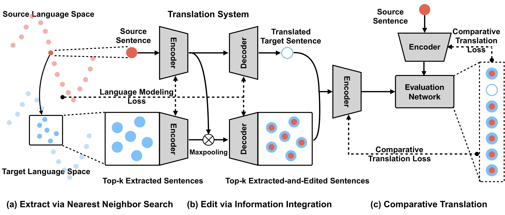

# Extract-Edit-Unsupervised-NMT

This repo hosts the source code for the following paper:
**Extract and Edit: An Alternative to Back-Translation for Unsupervised Neural Machine Translation**

## Model



## Code

TBU (April 2019)

## Reference

If you use the source code of this repo, please cite the following papers.

```
@inProceedings{naacl2019wu,
  author    = {Wu, Jiawei and Wang, Xin and Wang, William Yang},
  title     = {Extract and Edit: An Alternative to Back-Translation for Unsupervised Neural Machine Translation},
  booktitle = {Proceedings of the 2019 Conference of the North American Chapter of the Association for Computational Linguistics: Human Language Technologies},
  year      = {2019}
}

@inproceedings{lample2018phrase,
  author    = {Lample, Guillaume and Ott, Myle and Conneau, Alexis and Denoyer, Ludovic and others},
  title     = {Phrase-Based \& Neural Unsupervised Machine Translation},
  booktitle = {Proceedings of the 2018 Conference on Empirical Methods in Natural Language Processing},
  year={2018}
}
```

## Acknowledgement

The work was supported by the [Facebook Low-Resource NMT Research Award](https://research.fb.com/low-resource-nmt-awards/). The authors are solely responsible for the contents of the paper, and the opinions expressed in this publication do not reflect those of the funding agencies.

## License

MIT license
